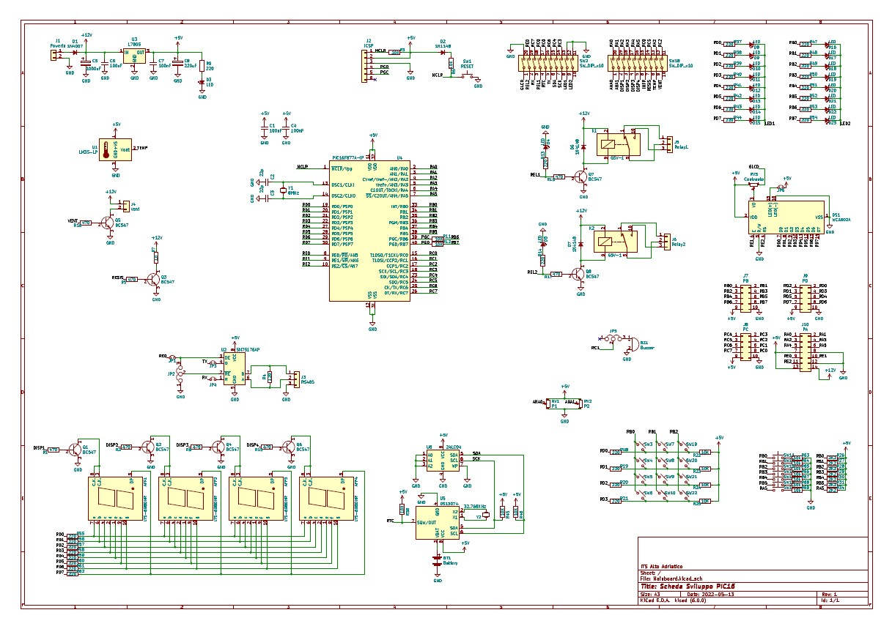

[< Home](/)

[<p align="right">Protocol Specification ></p>](../Protocol/)

**<h1 align="center">PIC Program Specification</h1>**

<div align="center">  
<h4>
    <a href="#lcd--menus"> Lcd & Menus </a>
  | <a href="#proto"> Proto </a>
  | <a href="#uart--collision-detection"> Uart & Collision Detection</a>
  | <a href="#sensors--actuators"> Sensors & Actuators </a>
</h4>
</div>

<div align="center">
<a href="./Docs/Schema.pdf"></a>
</div>

For better mantainability of the code wedecided to split it in libraris.   
Every library can be used on it's own.

## **Lcd & Menus**

This project require to:

* display on a screen some analog reading, like temperature and humidity, a text message and the wagon number (WN in the following tables)

* to allow the user to set the desired temperature for the wagon

To accomplished that we decided to go with a 2004 lcd display with the following screens:

#### *Home*

<div align="center">
<table>
<thead>
<tr>
<th><sup>1 </sup></th>
<th><sup>2 </sup></th>
<th><sup>3 </sup></th>
<th><sup>4 </sup></th>
<th><sup>5 </sup></th>
<th><sup>6 </sup></th>
<th><sup>7 </sup></th>
<th><sup>8 </sup></th>
<th><sup>9 </sup></th>
<th><sup>10 </sup></th>
<th><sup>11 </sup></th>
<th><sup>12 </sup></th>
<th><sup>13 </sup></th>
<th><sup>14 </sup></th>
<th><sup>15 </sup></th>
<th><sup>16 </sup></th>
<th><sup>17 </sup></th>
<th><sup>18 </sup></th>
<th><sup>19 </sup></th>
<th><sup>20 </sup></th>
</tr>
</thead>
<tbody>
<tr>
<td>&gt;</td>
<td></td>
<td>R</td>
<td>e</td>
<td>a</td>
<td>l</td>
<td></td>
<td>T</td>
<td>i</td>
<td>m</td>
<td>e</td>
<td></td>
<td>V</td>
<td>a</td>
<td>l</td>
<td>u</td>
<td>e</td>
<td>s</td>
<td></td>
<td></td>
</tr>
<tr>
<td></td>
<td></td>
<td>C</td>
<td>o</td>
<td>n</td>
<td>f</td>
<td>i</td>
<td>g</td>
<td>u</td>
<td>r</td>
<td>a</td>
<td>t</td>
<td>i</td>
<td>o</td>
<td>n</td>
<td></td>
<td></td>
<td></td>
<td></td>
<td></td>
</tr>
<tr>
<td></td>
<td></td>
<td></td>
<td></td>
<td></td>
<td></td>
<td></td>
<td></td>
<td></td>
<td></td>
<td></td>
<td></td>
<td></td>
<td></td>
<td></td>
<td></td>
<td></td>
<td></td>
<td></td>
<td></td>
</tr>
<tr>
<td></td>
<td>T</td>
<td>e</td>
<td>x</td>
<td>t</td>
<td></td>
<td>M</td>
<td>e</td>
<td>s</td>
<td>s</td>
<td>a</td>
<td>g</td>
<td>e</td>
<td></td>
<td>H</td>
<td>e</td>
<td>r</td>
<td>e</td>
<td></td>
<td></td>
</tr>
</tbody>
</table>
</div>

#### *Real Time Values*

<div align="center">
<table>
<thead>
<tr>
<th><sup>1 </sup></th>
<th><sup>2 </sup></th>
<th><sup>3 </sup></th>
<th><sup>4 </sup></th>
<th><sup>5 </sup></th>
<th><sup>6 </sup></th>
<th><sup>7 </sup></th>
<th><sup>8 </sup></th>
<th><sup>9 </sup></th>
<th><sup>10 </sup></th>
<th><sup>11 </sup></th>
<th><sup>12 </sup></th>
<th><sup>13 </sup></th>
<th><sup>14 </sup></th>
<th><sup>15 </sup></th>
<th><sup>16 </sup></th>
<th><sup>17 </sup></th>
<th><sup>18 </sup></th>
<th><sup>19 </sup></th>
<th><sup>20 </sup></th>
</tr>
</thead>
<tbody>
<tr>
<td>&gt;</td>
<td></td>
<td>B</td>
<td>e</td>
<td>a</td>
<td>k</td>
<td></td>
<td></td>
<td></td>
<td></td>
<td></td>
<td></td>
<td></td>
<td></td>
<td></td>
<td></td>
<td></td>
<td></td>
<td></td>
<td></td>
</tr>
<tr>
<td>T</td>
<td>e</td>
<td>m</td>
<td>p</td>
<td>°</td>
<td></td>
<td></td>
<td></td>
<td></td>
<td>W</td>
<td>N</td>
<td></td>
<td></td>
<td></td>
<td></td>
<td></td>
<td>H</td>
<td>u</td>
<td>m</td>
<td>%</td>
</tr>
<tr>
<td></td>
<td></td>
<td></td>
<td></td>
<td></td>
<td></td>
<td></td>
<td></td>
<td></td>
<td></td>
<td></td>
<td></td>
<td></td>
<td></td>
<td></td>
<td></td>
<td></td>
<td></td>
<td></td>
<td></td>
</tr>
<tr>
<td></td>
<td>T</td>
<td>e</td>
<td>x</td>
<td>t</td>
<td></td>
<td>M</td>
<td>e</td>
<td>s</td>
<td>s</td>
<td>a</td>
<td>g</td>
<td>e</td>
<td></td>
<td>H</td>
<td>e</td>
<td>r</td>
<td>e</td>
<td></td>
<td></td>
</tr>
</tbody>
</table>

</div>

#### *Configuration*

<div align="center">
<table>
<thead>
<tr>
<th><sup>1 </sup></th>
<th><sup>2 </sup></th>
<th><sup>3 </sup></th>
<th><sup>4 </sup></th>
<th><sup>5 </sup></th>
<th><sup>6 </sup></th>
<th><sup>7 </sup></th>
<th><sup>8 </sup></th>
<th><sup>9 </sup></th>
<th><sup>10 </sup></th>
<th><sup>11 </sup></th>
<th><sup>12 </sup></th>
<th><sup>13 </sup></th>
<th><sup>14 </sup></th>
<th><sup>15 </sup></th>
<th><sup>16 </sup></th>
<th><sup>17 </sup></th>
<th><sup>18 </sup></th>
<th><sup>19 </sup></th>
<th><sup>20 </sup></th>
</tr>
</thead>
<tbody>
<tr>
<td>&gt;</td>
<td></td>
<td>S</td>
<td>e</td>
<td>t</td>
<td></td>
<td>T</td>
<td>e</td>
<td>m</td>
<td>p</td>
<td></td>
<td></td>
<td></td>
<td></td>
<td></td>
<td>T</td>
<td>e</td>
<td>m</td>
<td>p</td>
<td>°</td>
</tr>
<tr>
<td></td>
<td></td>
<td>B</td>
<td>e</td>
<td>a</td>
<td>k</td>
<td></td>
<td></td>
<td></td>
<td></td>
<td></td>
<td></td>
<td></td>
<td></td>
<td></td>
<td></td>
<td></td>
<td></td>
<td></td>
<td></td>
</tr>
<tr>
<td></td>
<td></td>
<td></td>
<td></td>
<td></td>
<td></td>
<td></td>
<td></td>
<td></td>
<td></td>
<td></td>
<td></td>
<td></td>
<td></td>
<td></td>
<td></td>
<td></td>
<td></td>
<td></td>
<td></td>
</tr>
<tr>
<td></td>
<td>T</td>
<td>e</td>
<td>x</td>
<td>t</td>
<td></td>
<td>M</td>
<td>e</td>
<td>s</td>
<td>s</td>
<td>a</td>
<td>g</td>
<td>e</td>
<td></td>
<td>H</td>
<td>e</td>
<td>r</td>
<td>e</td>
<td></td>
<td></td>
</tr>
</tbody>
</table>

</div>

We created also some custom funcion to better manage those screens:

The LCD_Send comand is used to send single characters to the LCD.   
Outside the library it's used only to move the cursor, inside the library is mostly used to send comands to the LCD.

``` C
  void LCD_Send(char data, char mode)
```

The LCD_Write is used to send strings to the LCD, under the hood it uses the LCD_Send function but haveing a function that carry a string to the LCD by iterating it on it's own is easyer to manage.

``` C
  void LCD_Write(char phrase[])
```

The nextone uses both of the previous comand to draw on the screen the 2 menu's option you can choose between.

``` C
  void MENU_Page(char option1[], char option2[], char pointerLocation)
```

This comand is usefull to switch between the 2 menu's option.   
Inside it you will finde we used the LCD_Send function to mek the pointer move acros the rows.

``` C
  void MENU_Toggle()
```

The last comand is a comand used to react to the pression of the rotary encoder's knob.

``` C
  char MENU_Enter()
```

## **Proto**

You will find more information [here](../Protocol/README.md).

## **Uart & Collision Detection**

## **Sensors & Actuators**
