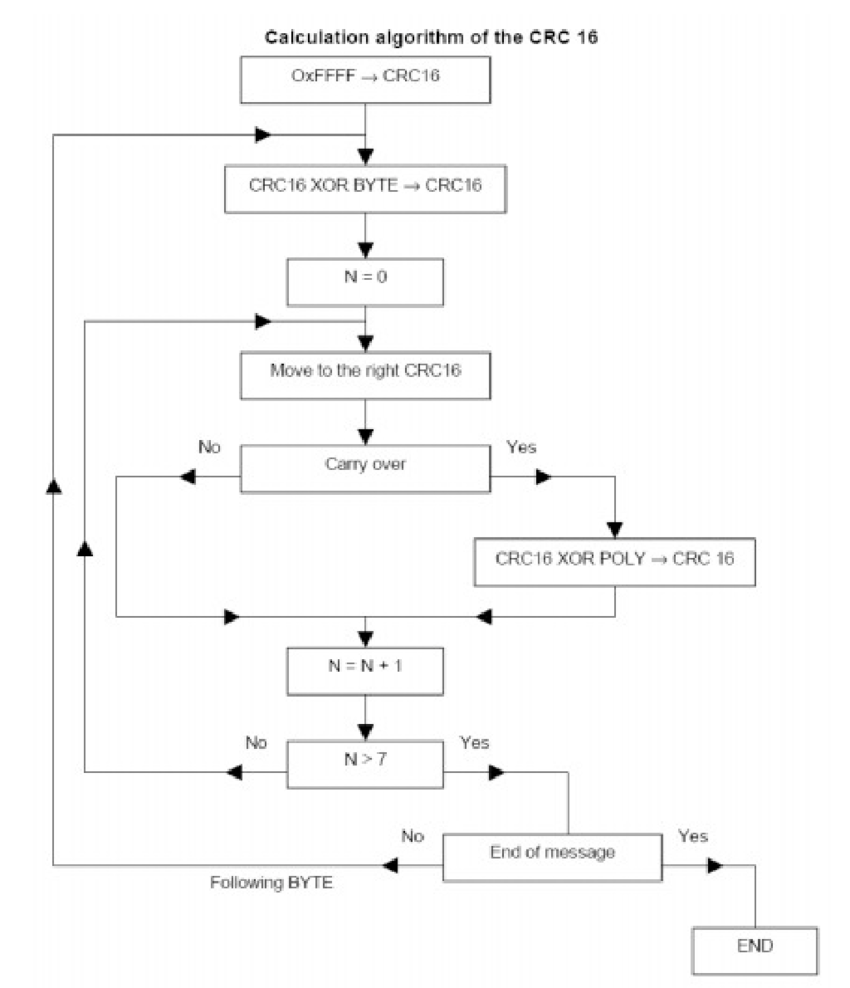

[< Home](../README.md)

[
Raspberry Pi >
](../RPI/README.md)

**<h1 align="center">Protocol Specification</h1>**

## **Addressing**

As message structure we decided to use a common structure designed as follows:

<table>
<thead>

<tr>
<th align="center">Id Reciver</th>
<th align="center">Id Sender</th>
<th align="center">Payload</th>
<th align="center"><a href='#crc-calc'>CRC</a></th>
</tr>

</thead>
</table>

## **Addresses**

We decided to inspire our serial network to the tcp/ip's one, so we gave to the RPI the available first id and use the very last one for the broadcast address to send to all the uC the same message. In this way the uCs are going to have 254 available address.

<table>
<thead>

<tr>
<th align="center">Device</th>
<th align="center">Id Given</th>
<th align="center">Id Available</th>
</tr>

</thead>

<tbody>

<tr>
<td align="center">RPI</td>
<td align="center">00</td>
<td align="center"></td>
</tr>

<tr>
<td align="center">PIC</td>
<td align="center"></td>
<td align="center">01-fe</td>
</tr>

<tr>
<td align="center">broadcast</td>
<td align="center">ff</td>
<td align="center"></td>
</tr>

</tbody>
</table>

## **Transmission Code**

To simplify the parsing of the messages we decided to place as the very first Byte of the message's payload a code that describes the message type and the meaning of it

<table>
<thead>

<tr>
<th align="center">Message Type</th>
<th align="center">Code</th>
<th align="center">Sender</th>
</tr>

</thead>

<tbody>

<tr>
<td align="center">Telemetry</td>
<td align="center">20</td>
<td align="center">PIC</td>
</tr>

<tr>
<td align="center">commands</td>
<td align="center">10-12</td>
<td align="center">RPI</td>
</tr>

<tr>
<td align="center">Text</td>
<td align="center">13</td>
<td align="center">RPI</td>
</tr>

<tr>
<td align="center">Handshake Request</td>
<td align="center">00</td>
<td align="center">broadcast(PIC before   having any id assigned)</td>
</tr>

<tr>
<td align="center">Handshake Response</td>
<td align="center">01</td>
<td align="center">RPI</td>
</tr>

</tbody>
</table>

## **Protocol Summary**

Here you can find some links to fastly travel in the documentatione:

<table>
<thead>

<tr>
<th align="center"></th>
<th align="center">PIC</th>
<th align="center">RaspberryPI</th>
</tr>

</thead>
<tbody>

<tr>
<td align="center">Telemetry</td>
<td align="center"><a href='#payload-telemetry'>More here</a></td>
<td align="center"></td>
</tr>

<tr>
<td align="center">Commands</td>
<td align="center"></td>
<td align="center"><a href='#payload-commands'>More here</a></td>
</tr>

<tr>
<td align="center">Text message</td>
<td align="center"></td>
<td align="center"><a href='#payload-text-message'>More here</a></td>
</tr>

<tr>
<td align="center">Handshake</td>
<td align="center"><a href='#handshake-request'>More here (request)</a></td>
<td align="center"><a href='#handshake-response'>More here (response)</a></td>
</tr>

</tbody>
</table>

#### **Payload Telemetry**

For the telemetry message we agreed on sending all the rading in the same message as we will send them periodicaly decreasing the ammount of cyclic message to send per uC.

This message will be sent every 10 seconds in every uC.

<table>
<thead>

<tr>
<th align="center">1° Byte</th>
<th align="center">2° Byte</th>
<th align="center">3° Byte</th>
<th align="center">4° Byte</th>
<th align="center">5° Byte</th>
<th align="center">6° Byte</th>
<th align="center">7° Byte</th>
<th align="center">8° Byte</th>
<th align="center">9° Byte</th>
<th colspan="4" align="center">10° Byte</th>
<th align="center">11° Byte</th>
<th align="center">12° Byte</th>
</tr>

<tr>
<th align="center"></th>
<th align="center"></th>
<th align="center"></th>
<th colspan="2" align="center"></th>
<th colspan="2" align="center"></th>
<th colspan="2" align="center"></th>
<th align="center">4° bit</th>
<th align="center">3° bit</th>
<th align="center">2° bit</th>
<th align="center">1° bit</th>
<th colspan="2" align="center"></th>
</tr>

</thead>
<tbody>

<tr>
<td align="center">id(RPI)</td>
<td align="center">id(PIC)</td>
<td align="center">code</td>
<td colspan="2" align="center">Current Temperature</td>
<td colspan="2" align="center">Set Temperature</td>
<td colspan="2" align="center">Humidity</td>
<td align="center">Emergency status</td>
<td align="center">Status back door</td>
<td align="center">Status front door</td>
<td align="center">Status toilette</td>
<td colspan="2" align="center">CRC</td>
</tr>

<tr>
<td align="center">00</td>
<td align="center"></td>
<td align="center">20</td>
<td colspan="2" align="center"></td>
<td colspan="2" align="center"></td>
<td colspan="2" align="center"></td>
<td colspan="4" align="center"></td>
<td colspan="2" align="center"></td>
</tr>

</tbody>
</table>

#### **Payload Commands**

At firt we thought it would have been a good idea to have all the commands on the same message using a unique code: 0x10.

Working our way to the interpreter of the messages and the sender of the commands we found out that we were forcing the RPI to send a bunch of Byte with no sense:

ex. We would have needed to finde a way to discriminate wather the target temp needed to stay the same as before or needed to change in response of the commands with target temp's bytes set to 0, for example.

So we decided to split the old monolithic command messages in  different command messages per macro-topics:

***Emergencies***

<table>
<thead>

<tr>
<th align="center">1° Byte</th>
<th align="center">2° Byte</th>
<th align="center">3° Byte</th>
<th colspan="2" align="center">4° Byte</th>
<th align="center">5° Byte</th>
<th align="center">6° Byte</th>
</tr>

<tr>
<th align="center"></th>
<th align="center"></th>
<th align="center"></th>
<th align="center">2° bit</th>
<th align="center">1° bit</th>
<th align="center"></th>
<th align="center"></th>
</tr>

</thead>
<tbody>

<tr>
<td align="center">id(PIC/broadcast)</td>
<td align="center">id(RPI)</td>
<td align="center">code</td>
<td align="center">Emergency reset</td>
<td align="center">Emergency set</td>
<td colspan="2" align="center">CRC</td>
</tr>

<tr>
<td align="center"></td>
<td align="center">00</td>
<td align="center">10</td>
<td colspan="2" align="center"></td>
<td colspan="2" align="center"></td>
</tr>

</tbody>
</table>

<!--=========================================-->

***Target Temp***

<table>
<thead>

<tr>
<th align="center">1° Byte</th>
<th align="center">2° Byte</th>
<th align="center">3° Byte</th>
<th align="center">4° Byte</th>
<th align="center">5° Byte</th>
<th align="center">6° Byte</th>
<th align="center">7° Byte</th>
</tr>

</thead>
<tbody>

<tr>
<td align="center">id(PIC/broadcast)</td>
<td align="center">id(RPI)</td>
<td align="center">code</td>
<td colspan="2" align="center">Target temperature</td>
<td colspan="2" align="center">CRC</td>
</tr>

<tr>
<td align="center"></td>
<td align="center">00</td>
<td align="center">11</td>
<td colspan="2" align="center"></td>
<td colspan="2" align="center"></td>
</tr>

</tbody>
</table>

<!--=========================================-->

***Doors***

<table>
<thead>

<tr>
<th align="center">1° Byte</th>
<th align="center">2° Byte</th>
<th align="center">3° Byte</th>
<th colspan="2" align="center">4° Byte</th>
<th align="center">5° Byte</th>
<th align="center">6° Byte</th>
</tr>

<tr>
<th align="center"></th>
<th align="center"></th>
<th align="center"></th>
<th align="center">2° bit</th>
<th align="center">1° bit</th>
<th colspan="2" align="center"></th>
</tr>

</thead>
<tbody>

<tr>
<td align="center">id(PIC/broadcast)</td>
<td align="center">id(RPI)</td>
<td align="center">code</td>
<td align="center">Toggle back door</td>
<td align="center">Toggle front door</td>
<td colspan="2" align="center">CRC</td>
</tr>

<tr>
<td align="center"></td>
<td align="center">00</td>
<td align="center">12</td>
<td colspan="2" align="center"></td>
<td colspan="2" align="center"></td>
</tr>

</tbody>
</table>

#### **Payload Text Message**

In the first iteration of our protocol we thought it would be a nice idea to have the the text message inside the command pyload.

As soon as we did it we discovered it was a bad decision so we decided to have a message code and also a message type specific for the text message.

<table>
<thead>

<tr>
<th align="center">1° Byte</th>
<th align="center">2° Byte</th>
<th align="center">3° Byte</th>
<th align="center">4°-23° Byte</th>
<th align="center">24° Byte</th>
<th align="center">25° Byte</th>
</tr>

</thead>
<tbody>

<tr>
<td align="center">id(PIC/broadcast)</td>
<td align="center">id(RPI)</td>
<td align="center">code</td>
<td align="center">Characters</td>
<td  colspan="2" align="center">CRC</td>
</tr>

<tr>
<td align="center"></td>
<td align="center">00</td>
<td align="center">13</td>
<td align="center"></td>
<td colspan="2" align="center"></td>
</tr>

</tbody>
</table>

#### **Handshake Request**

When an uC is newly connected to the network and turned on it will not have any address so here comes in heand the Handshake request.

This request will be performed as broadcast impersonification and after this request the uC will wait for a response to get an address.

<table>
<thead>

<tr>
<th align="center">1° Byte</th>
<th align="center">2° Byte</th>
<th align="center">3° Byte</th>
<th align="center">4° Byte</th>
<th align="center">5° Byte</th>
</tr>

</thead>
<tbody>

<tr>
<td align="center">id(RPI)</td>
<td align="center">id(broadcast)</td>
<td align="center">code</td>
<td colspan="2" align="center">CRC</td>
</tr>

<tr>
<td align="center">00</td>
<td align="center">ff</td>
<td align="center">00</td>
<td colspan="2" align="center"></td>
</tr>

</tbody>
</table>

#### **Handshake Response**

When the RPI recives an Handshake request it will supply an available address to the uC listenning addressing the reciver as broadcast building the message as follow:

<table>
<thead>

<tr>
<th align="center">1° Byte</th>
<th align="center">2° Byte</th>
<th align="center">3° Byte</th>
<th align="center">4° Byte</th>
<th align="center">5° Byte</th>
<th align="center">6° Byte</th>
</tr>

</thead>
<tbody>

<tr>
<td align="center">id(broadcast)</td>
<td align="center">id(RPI)</td>
<td align="center">code</td>
<td align="center">new id(PIC)</td>
<td colspan="2" align="center">CRC</td>
</tr>

<tr>
<td align="center">ff</td>
<td align="center">00</td>
<td align="center">01</td>
<td align="center"></td>
<td colspan="2" align="center"></td>
</tr>

</tbody>
</table>

#### **CRC Calc**

We decided to use the same crc used in Modbus protocol, which is a 16 bit crc, with the Big Endian standard: haveing so the less significant byte first than the most significant one.

<table>
    
<tr>
<td align="center" valign="center">

</td>
</tr>

</table>

