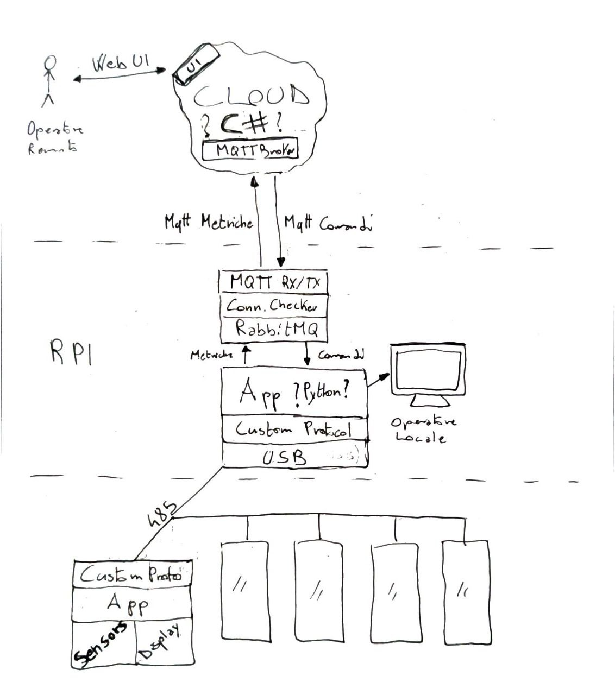

# PW-Gruppo2-LovelyCommit

  
<h4>
    <a href="#project-trace"> Project Trace </a>
  | <a href="#schemas"> Schemas </a>
  | <a href="#hardware-component"> Hardware component</a>
  | <a href="#protocol-pic-rpi-structure"> Protocol PIC-RPI Structure </a>
  | <a href="#amqp-rpi"> AMQP RPI </a>
  | <a href="#mqtt-rpi-azure"> Mqtt RPI-Azure </a>
</h4>

Project Work 2022 Group 2 Corso Diqu
Faraoni Matteo, Gatto Alessandro, Pizzato Davide, Scapolan Davide

## Project Trace
The **UAR**, Upper Adriatic Railroad, requires the creation of a system to monitor the status of the wagons and to be able to control their behavior both from a booth inside the train and remotely.
It was decided to implement an RS485 BUS system that connects each carriage, in which there is a custom uC card capable of detecting **temperature**, **humidity**, and **door closing status**, in addition to verifying if someone's in the **toilet** compartment.
In addition, the microcontroller can **independently control the air conditioning** for each wagon, the **opening of the doors** and the **emergency signals**. An LCD display is also required for each wagon, it must be capable of displaying messages sent by the remote controller, reading the sensors and modifying the operating parameters.

All this information then is sent and received with a proprietary protocol by an RPI that acts as a Gateway connected to a network with internet access, then it will publish it. Publishing it will allow a remote operator to check the status and possibly modify the states of the actuators.
An information queue must also be provided if the connection with the cloud fails while crossing tunnels.

Additional features may be proposed by individual groups.

## Schemas

To be able to view any .drowio file open [this link](https://draw.io), than open the file from the repository

<!-- ||
|-|-->

  

  

## Hardware component
***
**Elements on the list supplied**:

* GY-BME280 barometric sensor for temperature, humidity and air pressure

* Motion sensor HC-SR501 PIR motion detection module
	`Used for automatic presence detection in bathrooms` 

**External element**:

*  20 microswitches with debouncing pullup components
	`Used for open/closed detection of all the doors in the wagon`

* 24V bulb with power supply etc (provided you mount the relays)

## Protocol PIC-RPI Structure
***
|- |PIC|RaspberryPI|
|:-------------:|:-------------:|:-----:|
|Data sent from PIC to a RPI|id(RPI)_Payload()_CRC|id(PIC)_OK_CRC|
|Data sent from RPI to a PIC|id(RPI)_OK_CRC|id(PIC/Broadcast)_Payload_CRC|
|Handashake between PIC and RPI|id(RPI)_handshakeCode_CRC|id(RPI)_newId(PIC)_CRC|

#### Payload Telemetry
The payloads will be sent in this (static) order: 
|1° and 2° Byte|3° and 4° Byte|5° Byte 3° bit|5° Byte 2° bit|5° Byte 1° bit|
|:---:|:---:|:---:|:---:|:---:|
|Temperature|Humidity|Status back door|Status front door|Status bathroom|

#### Payload Commands
|1° e 2° Byte|3° Byte 2° bit|3° Byte 1° bit|4° Byte|5° to X° Byte|
|:---:|:---:|:---:|:---:|:---:|
|Target temperature|Status back door|Status front door|Length of the message (number of byte)|Message (if te Length is greater then 0)|

#### CRC Calc
Library?

## AMQP RPI
***

## Mqtt RPI-Azure
***
