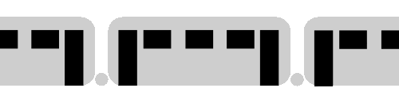

[< Home](./README.md)

[
uController >
](./PIC/README.md)

<!---->

**<h1 align="center">PW-Gruppo2-LovelyCommit</h1>**

    

  
<h4>
    <a href="#project-trace"> Project Trace </a>
  | <a href="#schemas"> Schemas </a>
  | <a href="#ucontroller"> uController</a>
  | <a href="#raspberrypi"> RaspberryPi </a>
  | <a href="#cloud"> Cloud </a>
  | <a href="#documents"> Documents </a>
  | <a href="#contributores"> Contributores </a>
</h4>

## *Project Work 2022 Group 2 Corso Diqu*

<table>
<thead>

<tr>
<th align="center">Name</th>
<th align="center">E-mail</th>
</tr>

</thead>
<tbody>

<tr>
<td align="center">Faraoni Matteo</td>
<td align="center">matteo.faraoni@stud.tecnicosuperiorekennedy.it</td>
</tr>
    
<tr>
<td align="center">Gatto Alessandro</td>
<td align="center">alessandro.gatto@stud.tecnicosuperiorekennedy.it</td>
</tr>
    
<tr>
<td align="center">Pizzato Davide</td>
<td align="center">davide.pizzato@stud.tecnicosuperiorekennedy.it</td>
</tr>
   
<tr>
<td align="center">Scapolan Davide</td>
<td align="center">davide.scapolan@stud.tecnicosuperiorekennedy.it</td>
</tr>
    
</table>

## **Project Trace**

The **UAR**, Upper Adriatic Railroad, requires the creation of a system to monitor the status of the wagons and to be able to control their behavior both from a booth inside the train and remotely.
It was decided to implement an RS485 BUS system that connects each carriage, in which there is a custom uC card capable of detecting **temperature**, **humidity**, and **door closing status**, in addition to verifying if someone's in the **toilet** compartment.
In addition, the microcontroller can **independently control the air conditioning** for each wagon, the **opening of the doors** and the **emergency signals**. An LCD display is also required for each wagon, it must be capable of displaying messages sent by the remote controller, reading the sensors and modifying the operating parameters.

All this information then is sent and received with a proprietary protocol by an RPI that acts as a Gateway connected to a network with internet access, then it will publish it. Publishing it will allow a remote operator to check the status and possibly modify the states of the actuators.
An information queue must also be provided if the connection with the cloud fails while crossing tunnels.

Additional features may be proposed by individual groups.

## **Schemas**

To be able to view any .drowio file open [this link](https://draw.io), than open the file from the repository

<table>
    
<tr>
<td align="center" valign="center">

</td>

<td align="center" valign="center">

</td>
</tr>
    
</table>

## **uController**

### **Hardware component**

*Elements on the list supplied*:

* GY-BME280 barometric sensor for temperature, humidity and air pressure

* Motion sensor HC-SR501 PIR motion detection module  
 `Used for automatic presence detection in bathrooms` 

*External element*:

* 20 microswitches with debouncing pullup components  
 `Used for open/closed detection of all the doors in the wagon`

* led 3.3V

*Already in our possession*:

* 4 2004 LCD Display

* 2 servomotor

* 4 rotary encoder

### **Protocol PIC-RPI Structure**

<table>
<thead>

<tr>
<th align="center"></th>
<th align="center">PIC</th>
<th align="center">RaspberryPI</th>
</tr>

</thead>
<tbody>

<tr>
<td align="center">Telemetry</td>
<td align="center">id(RPI)_Payload_CRC</td>
<td align="center"></td>
</tr>

<tr>
<td align="center">Commands</td>
<td align="center"></td>
<td align="center">id(PIC/Broadcast)_Payload_CRC</td>
</tr>

<tr>
<td align="center">Text message</td>
<td align="center"></td>
<td align="center">id(PIC/Broadcast)_Payload_CRC</td>
</tr>

<tr>
<td align="center">Handshake</td>
<td align="center">id(RPI)_Payload_CRC</td>
<td align="center">id(RPI)_Payload_CRC</td>
</tr>

</tbody>
</table>

[Here](./Protocol/README.md) you can finde more specification about how does this protocl works and wor does it has been developped

## **RaspberryPi**

### **AMQP**

We decided to use the AMQP protocol as a queue, using a RabbitMQ broker we will be able to host everything in the RPI.

It will behave as an abstraction layer between the parsed telemetries comming from the uCs and the commands sent from RPI's HMI or the Cloud's Web App.   
Every data sent to and from the uC will have to go through it on a specific queue.

This approach allows us to separate the code used to interpret send and recive messages of the uCs from the code used for the RPI's HMI or to send and recive data from the Cloud.

### **Mqtt**

This protocol is used to interaction between the RPI and the Cloud's services.   
We implemented the AMQP's queue for when the connection is down or the Cloud is unreachable but when the connection is established we will use this protocol to comunicate.

As soon as the Cloud can be reached the queue will be emtied sending all the messages to the cloud where will be parsed and stored on a database.

## **Cloud**

The telemety values recived from the MQTT broker of all the trains and wagons will be recived by a parser that will store the datas on a db with different headers depending on the reciving topics.

From here the telemetries are shown on the Web App and through the form inside it the user will be able to send comands according to the permissions his account has.

The comands then will be directed on the apropriated topic to reach the RPI.

## **Documents**

* [uController section](./PIC/)
* [Protocol section](./Protocol/)
* [RaspberryPi section](./RPI/)
* [MQTT section](./MQTT/)
* [Cloud section](./Cloud/)

## **LICENSE**

LovelyCommit is provided under the [GNU General Public License Version 3](./LICENSE)

## **Contributores**

Made with [contrib.rocks](https://contrib.rocks).

